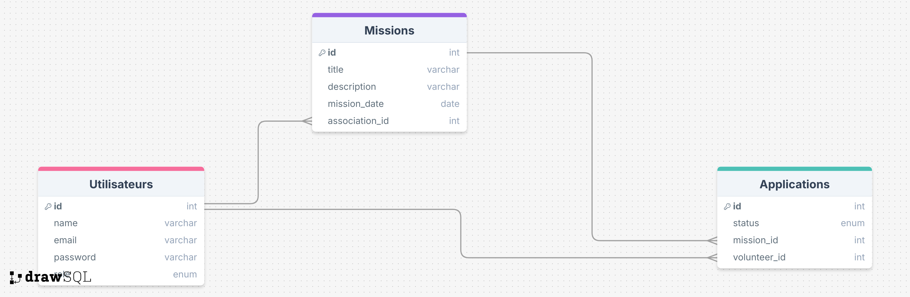
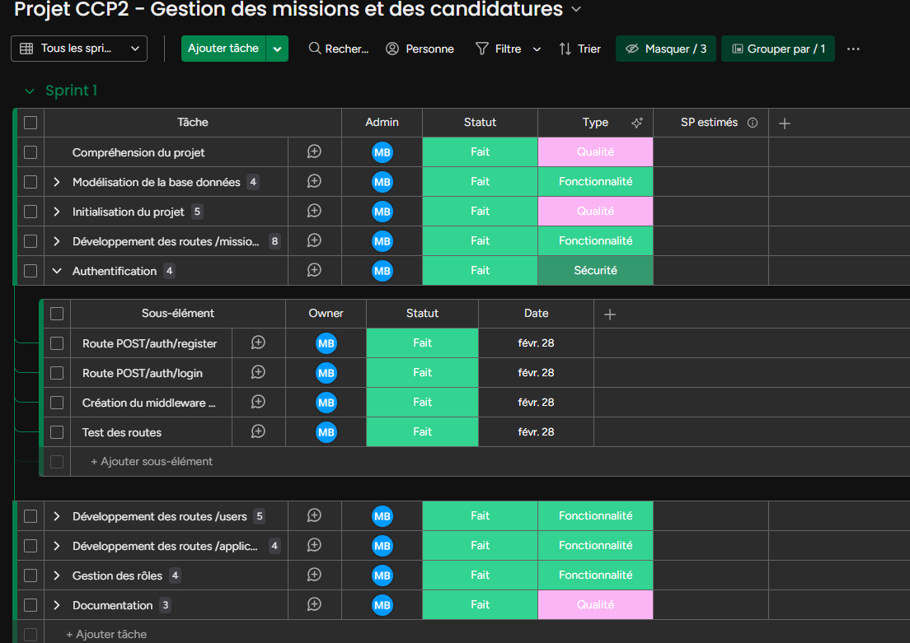
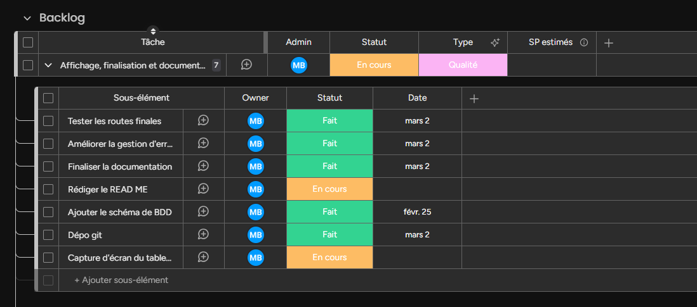

# Projet-CCP2-TP-DEV-WEB

Projet d'évaluation CCP2 dans le cadre du TP Dev Web.

## Présentation du Projet

Création d'un backend pour une plateforme permettant aux bénévoles de postuler à des missions proposées par des associations.

## Fonctionnalités

1. Authentification

   - Un utilisateur peut se connecter ou s'inscrire sur la plateforme
   - Il y a deux rôles possibles pour un utilisateur: volunteer, asssociation.
   - L'authentification se fait via un token JWT.

2. Missions

   - Une association peux créer, modifier et supprimer des missions.
   - Un bénévole peut consulter la liste des missions disponibles.
   - Une association peux consulter la liste des candidatures en attente pour chaque mission.

3. Candidatures
   - Une bénévole peut postuler a une mission.
   - Une candidature est par defaut en "pending".
   - Une association peux accepter ou refuser une candidature.

## Installation et configuration

**Prérequis**

- Node.js (v22.11.0+)
- Base de données MariaDB

**Etapes pour installer l'application**

- Cloner le dépôt:

```bash
git clone https://github.com/devbmel/Projet-CCP2-TP-DEV-WEB.git
```

- Installer les dépendances:

```bash
npm install
```

- Créer un fichier .env:

```
SERVER_PORT = port_application
DB_HOST = adresse_hote_bdd
DB_USER = utilisateur_bdd
DB_PASSWORD = mot_de_passe_bdd
DATABASE = nom_bdd
DB_PORT = port_bdd
JWT_SECRET = secret_jwt
NODE_ENV = 'DEV'
```

- Configurer la base de données:

Executer les scripts SQL fournis _(script.sql)_ et insérer les données test _(dataTest.sql)_.

- Démarrer l'application:

```bash
npm start
```

_Remarques: Les routes peuvent être testées via postman ou via la documentation swagger disponible à l'adresse: **http://HOST:PORT/api-docs**_

## Choix technologique

**Pourquoi MySQL (MariaDb)**
Dans ce projet j’ai pu remarquer que les entités étaient fortement liées entre elles,
c’est pour cela qu’une base de données relationnelle me paraît la plus pertinente.
Ces relations sont facilement gérables grâce aux clés étrangères.
Il y a aussi une garantie plus forte de l’intégrité des données.

**Le détails des relations:**

- Une association peut créer plusieurs missions. (1:N)
- Un bénévole peut postuler à plusieurs missions. (1:N)
- Une mission peut avoir plusieurs candidatures. (1:N)

**Schema de la base de données**


**Pourquoi swagger**

- Documentation claire
- Routes testables
- Format de données d'entrées et sorties
- Code d'erreurs

**Pourquoi cette architecture**

- Organisation du code => meilleure lisibilité
- Séparation des responsabilités
- Réutilisation et maintenance simplifiées
- Ajout de nouvelles fonctionnalitées simplifié sans perturber les autres parties du code.

## Gestion de projet

Utilisation de la version d'essai de Monday _(https://monday.com/)_




## Plan de test

https://docs.google.com/spreadsheets/d/1P_9WWTBQLBKU1T3bAjzeU7JGSGbToxruplaM4Sxvwlg/edit?usp=sharing
